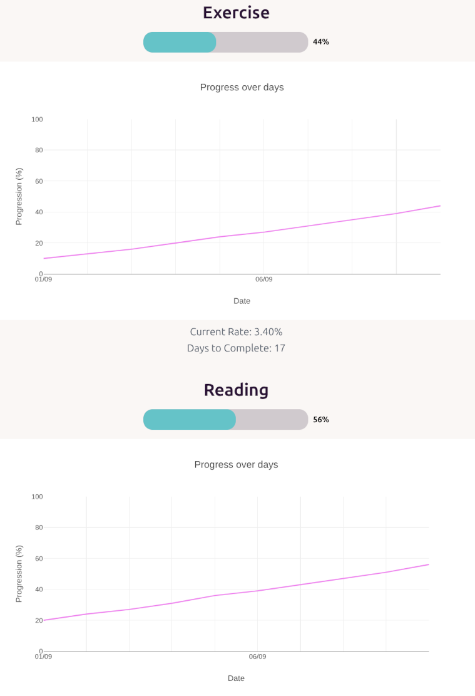

# Web Journal

A front end showing detailed data analysis based on personal journal.

## Keeping a Journal

As we grow older, the days seem to be going away fast.
Although very much busy every day but seems easy to forget
what happened yesterday, let alone remember what happened
days ago.

Based on that I started keeping a journal, to keep track
of what I do everyday. Like children's games, points are given
for completing various tasks. Helps quite a bit for motivation to
do tedious chores.

But keeping this journal itself sometimes can feel like a chore.
And so the idea that if I can visualize my journal, points
etc then that would be a motivation boost to enter into the
journal everyday. And thus this site which shows visualization
based on journal data.

## Journal

Although free writing text in the Journal is fun, the entries
needs to have some structure in order to for data analysis
later on.

The journal format is simple like:

25 April 2025
- Wake up early 5
- Make breakfast 10
- Work on project 20

Each entry has a number points at the end.
A rough estimate of the amount of effort I
think that task took.

Free writing texts are also allowed, they just would not have
the points attached to them.

## Analysis

A python script shifts and parses through the
journal files. The extracted data is then put
into a database.

The parser is currently in another private repository since
they contain personal infomation.

## Visualization

The code for visualizing the data is what this
repository is all about.

The website is static and is meant for being
hosted on a local server. For me it is a Raspberry Pi.

## Tech stack

- Python based parser that parses the raw markdown files containing the journal entries. The data in then stored into the database. The script is run by a cron job on a predefined schedule to get new journal entries.
- SQLite database for storing the parsed data.
- FastAPI as the server to query from the database and serve the frontend.
- Svelte for the frontend with typescript and daisy ui for styling. Plotly.js is used for ploting the graphs.

  The seperation of concerns in the stack really helps to split the logic into managable chunks.

## Future

More visualizations are planed using more data for example from
google timeline to track my movements for the day.

## Dev Notes

Set the path to the sqlite database:

    export JOURNAL_DATABASE_PATH=/home/ash/journal.db

Run the sever:

    uvicorn main:app --host 0.0.0.0 --port 8181 --reload

Run the front end

    npm run dev

## Deployment

PI has a hard time building the web frontend,
so build it on PC then upload the build artifacts to the repository,
then deploy it to the PI.

Note to change the server address to the PI address before building:

    export const serverAddress = 'http://0.0.0.0:8181';

Nginx setup script:

    /etc/nginx/sites-available/default
