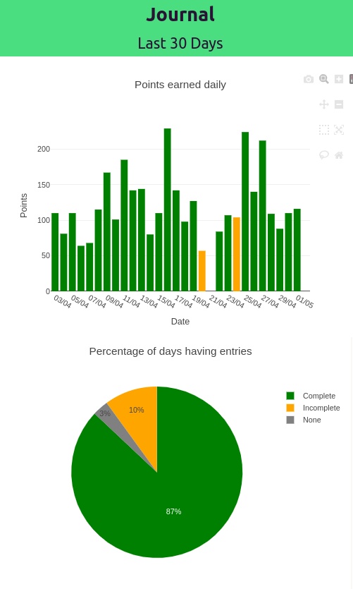

# web-journal

A front end showing detailed data analysis based on personal journal.

## Keeping a Journal

As we grow older, the days seem to be going away fast.
So much busy every day, I seem to forget what happened
yesterday, let alone remember what happened days ago.

Based on that I started keeping a journal, to keep track
of what I do everyday. Like children's games, I give myself
points for completing various tasks. Helps to motivate to
do tedious chores since they have large points.

But keeping this journal itself sometimes feels like a chore.
And so the idea that if I can visualize my journal, points
etc then that would be quite a motivation to entry into the
journal everyday. And thus this site which shows visualization
based on journal data.

## Journal

The journal format is simple like:

25 April 2025
- Wake up early 5
- Make breakfast 10
- Work on project 20

Each entry has a number points at the end.
A rough estimate of the amount of effort I
think that task took.

## Analysis

A python script shifts and parses through the
journal files. The extracted data is then put
into a database.

The script is currently in another repository,
and not public at the moment.

## Visualization

The code for visualizing the data is what this
repository is all about.

The website is static and is meant for being
hosted on a local server. For me it is a PI.

At the moment it is showing some basic data on
how many days I entered into the journal.

## Tech stack

- SQLite DB for storing data.
- FastAPI as the server to query from the database and server the frontend
- Sveltekit for the frontend.

## Future

More visualizations are planed using more data for example from
google timeline to track my movements for the day.

## Dev Notes

Set the path to the sqlite database:

    export JOURNAL_DATABASE_PATH=/home/ash/journal.db

Run the sever:

    uvicorn main:app --host 0.0.0.0 --port 8181 --reload

Run the front end

    npm run dev

## Deployment

PI has a hard time building the web frontend,
so build it on PC then upload the build artifacts to the repository,
then deploy it to the PI.

Note to change the server address to the PI address before building:

    export const serverAddress = 'http://0.0.0.0:8181';

Nginx setup script:

    /etc/nginx/sites-available/default
